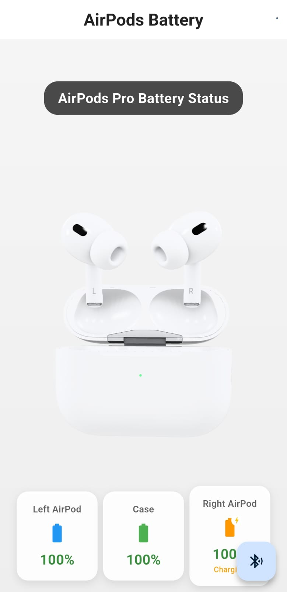

# AirpodsAndro 🎧📱

A Flutter Android app to check Apple AirPods battery levels on Android devices using Bluetooth Low Energy (BLE).

## 🎯 Project Story

My dad gave me his AirPods, but I have an Android phone. Unlike iPhone users who can easily see AirPods battery levels, Android users are left in the dark. I wanted to solve this problem by creating an app that displays AirPods battery status on Android devices.

## ⚠️ Work in Progress

This project is currently **under active development**. Features and functionality may change as development continues.

## ✨ Features

- 🔋 **Real-time Battery Monitoring**: Display battery levels for left pod, right pod, and charging case
- 🔵 **Bluetooth Integration**: Uses BLE to communicate with AirPods
- 🎨 **3D Visualization**: Interactive 3D model of AirPods Pro with battery overlay

## 🚀 How It Works

The app uses Bluetooth Low Energy (BLE) to scan for Apple devices and decode the manufacturer data that contains battery information. It specifically:

1. Scans for devices with Apple's manufacturer ID (0x004C)
2. Parses the BLE advertisement data to extract battery levels
3. Handles the AirPods protocol to determine individual pod and case battery levels
4. Displays real-time updates with charging status indicators

## 📱 Supported Devices

- **AirPods Pro (2nd generation)**

## 📸 Screenshots

### Prototype UI



*Current prototype showing AirPods Pro with real-time battery monitoring for left pod, right pod, and charging case*

## 🛠️ Tech Stack

- **Flutter** - Cross-platform mobile framework
- **Dart** - Programming language
- **flutter_blue_plus** - Bluetooth Low Energy plugin
- **model_viewer_plus** - 3D model rendering

## 📋 Prerequisites

- Android device with Bluetooth 4.0+ (BLE support)
- Android API level 21+ (Android 5.0)
- Location permissions (required for BLE scanning)
- Bluetooth permissions

## 🏗️ Installation

### For Developers

1. Clone the repository:

   ```bash
   git clone https://github.com/your-username/AirpodsAndro.git
   cd AirpodsAndro
   ```
2. Install Flutter dependencies:

   ```bash
   flutter pub get
   ```
3. Connect your Android device or start an emulator
4. Run the app:

   ```bash
   flutter run
   ```

## 🔧 Development Setup

### Required Tools

- Flutter SDK (3.35.3 or later)
- Android Studio / VS Code
- Android SDK
- Git

### Build Commands

```bash
# Debug build
flutter build apk --debug

# Release build
flutter build apk --release

# Install and run
flutter run
```

## 📁 Project Structure

```
lib/
├── main.dart                 # App entry point
├── models/
│   └── battery_status.dart   # Battery data model
├── services/
│   └── ble_service.dart      # Bluetooth Low Energy service
├── screens/
│   └── home_screen.dart      # Main app screen
└── widgets/
    └── airpods_view.dart     # 3D AirPods visualization widget
```

## 🐛 Known Issues

- Some Android devices may have different BLE scanning behaviors
- Background scanning limitations on newer Android versions
- Occasional connection drops requiring manual refresh

## 🙏 Acknowledgments

- **OpenPods** - Reference implementation for AirPods BLE protocol
- **Flutter Blue Plus** - Excellent BLE plugin for Flutter
- **Apple** - For creating AirPods (even if they don't play nice with Android 😄)
- **Dad** - For giving me the AirPods that started this whole project

## 📞 Contact

If you have questions, suggestions, or just want to chat about the project, feel free to open an issue!

---

**Note**: This app is not affiliated with Apple Inc. AirPods is a trademark of Apple Inc.
